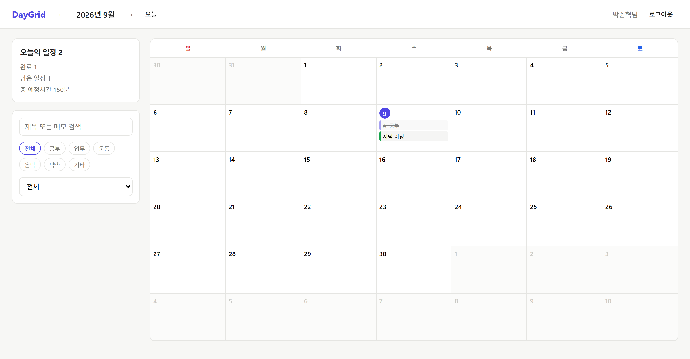
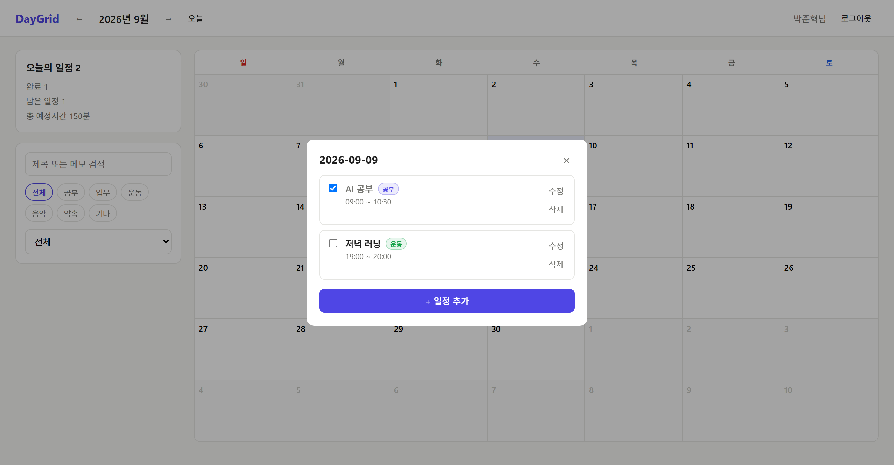

# AIFFEL Campus Code Peer Review Templete
- 코더 : 박준혁 님
- 리뷰어 : 김보겸 님

> 리뷰 방법: 코드를 읽는 것에 더해, 제출된 프로젝트를 실제로 로컬에서 실행해서 확인했습니다.
> (`backend`·`frontend` 의존성 설치 → `npm run db:migrate:local` → `npm run build` → `wrangler dev` →
> `curl`로 전체 API 흐름 호출)
>
> 참고: 1번 항목의 '주어진 문제'는 첨부 이미지를 기준으로 하기로 했으나 이미지가 전달되지 않아,
> 저장소의 `README.md`(요구 항목이 목차로 정리되어 있음)와 `domain-decomposition.md`에 적힌
> 과제 요구사항 — **로그인/회원가입이 있는 웹서비스, CRUD, 인증·인가, 쿠키/세션, 비밀번호
> 해시·솔트, 환경변수, DB 설계, 배포** — 을 기준으로 판단했습니다.


# PRT(Peer Review Template)
[x]  **1. 주어진 문제를 해결하는 완성된 코드가 제출되었나요?**
- 문제에서 요구하는 기능이 정상적으로 작동하는지?
    - 해당 조건을 만족하는 부분의 코드 및 결과물을 근거로 첨부

요구 기능이 모두 코드로 존재하고, **실제로 실행해서 동작까지 확인**했습니다.

**근거 1 — API 라우팅이 요구 기능을 빠짐없이 덮고 있습니다.** (`backend/src/index.js` 18~60행)

```js
async function handleApi(request, env) {
  const url = new URL(request.url);
  const { pathname } = url;
  const method = request.method;

  // ---- 인증 관련 (로그인 불필요) ----
  if (pathname === '/api/auth/register' && method === 'POST') { return handleRegister(request, env); }
  if (pathname === '/api/auth/login' && method === 'POST') { return handleLogin(request, env); }
  if (pathname === '/api/auth/me' && method === 'GET') { return handleMe(request, env); }
  if (pathname === '/api/auth/logout' && method === 'POST') { return handleLogout(request, env); }

  // ---- 일정 관련 (로그인 필요) ----
  if (pathname.startsWith('/api/events')) {
    const user = await getCurrentUser(request, env);
    if (!user) return errorResponse('로그인이 필요합니다.', 401);

    if (pathname === '/api/events' && method === 'GET') return handleListEvents(request, user, env);
    if (pathname === '/api/events' && method === 'POST') return handleCreateEvent(request, user, env);

    const toggleMatch = pathname.match(/^\/api\/events\/([^/]+)\/toggle$/);
    if (toggleMatch && method === 'PATCH') return handleToggleEvent(request, user, env, toggleMatch[1]);

    const idMatch = pathname.match(/^\/api\/events\/([^/]+)$/);
    if (idMatch) {
      const id = idMatch[1];
      if (method === 'GET') return handleGetEvent(request, user, env, id);
      if (method === 'PUT') return handleUpdateEvent(request, user, env, id);
      if (method === 'DELETE') return handleDeleteEvent(request, user, env, id);
    }
  }
  return errorResponse('요청한 API를 찾을 수 없습니다.', 404);
}
```

회원가입·로그인·로그인 유지(`/me`)·로그아웃과 일정 CRUD·완료 토글이 전부 연결되어 있고,
`/api/events`로 들어오는 모든 요청은 **핸들러에 닿기 전에 로그인 검사를 한 번만 통과**하도록
묶여 있습니다. 라우팅 한 곳만 봐도 기능 목록이 파악되는 구조라서 좋았습니다.

**근거 2 — 실행해서 전체 흐름을 호출한 결과입니다.** (로컬 Worker `http://127.0.0.1:8787`)

```console
$ POST /api/auth/register   회원가입
{"id":"bae54071-...","name":"박준혁","email":"junhyuk2@example.com"}        [HTTP 201]

$ POST /api/auth/login   로그인 (세션 쿠키 발급)
{"id":"bae54071-...","name":"박준혁","email":"junhyuk2@example.com"}        [HTTP 200]
  Set-Cookie: daygrid_session=c952101b2cfcbccd403f...  HttpOnly

$ GET /api/auth/me   로그인 상태 유지 확인                                   [HTTP 200]

$ POST /api/events   일정 생성 (Create)
{"id":"59a63816-...","title":"AI 공부","date":"2026-09-10","startTime":"09:00",
 "endTime":"10:30","category":"study","memo":"LMS 노드 정리","completed":false}  [HTTP 201]

$ GET /api/events?year=2026&month=9   월간 조회 (Read)                       [HTTP 200]
$ PUT /api/events/:id   수정 (Update)                                        [HTTP 200]
$ PATCH /api/events/:id/toggle   완료 토글
{"completed":true,"completedAt":"2026-09-09T02:36:32.103Z"}                  [HTTP 200]

$ GET /api/events   쿠키 없이 요청 → 인증 실패
{"error":"로그인이 필요합니다."}                                              [HTTP 401]

$ POST /api/events   잘못된 입력 → 서버 측 재검증
{"error":"제목은 1~100자로 입력해주세요. 날짜 형식이 올바르지 않습니다 (YYYY-MM-DD).
          올바르지 않은 카테고리입니다."}                                     [HTTP 400]

$ GET /api/events/:id   다른 사용자가 남의 일정 id로 조회 → 인가 차단
{"error":"일정을 찾을 수 없습니다."}                                          [HTTP 404]

$ DELETE /api/events/:id   다른 사용자가 삭제 시도 → 인가 차단                 [HTTP 404]
$ DELETE /api/events/:id   본인 일정 삭제 (Delete)  {"ok":true}               [HTTP 200]
```

CRUD 5종이 모두 정상 응답하고, **로그인하지 않은 요청은 401**, **남의 일정에 접근하면 404**로
막히는 것까지 실제로 확인했습니다. 잘못된 입력을 넣었을 때 프론트가 아니라 서버가 걸러 주는 것도
확인했습니다.

**근거 3 — 실행 화면입니다.**





월간 캘린더, 오늘의 일정 요약(완료/남은 일정/총 예정시간), 카테고리·완료 필터, 날짜 클릭 시
모달에서의 완료 체크·수정·삭제까지 화면에서 그대로 동작했습니다. 완료된 일정에 취소선이 들어가는
것도 확인됩니다.


[x]  **2. 핵심적이거나 복잡하고 이해하기 어려운 부분에 작성된 설명을 보고 해당 코드가 잘 이해되었나요?**
- 해당 코드 블럭에 doc string/annotation/markdown이 달려 있는지 확인
- 해당 코드가 무슨 기능을 하는지, 왜 그렇게 짜여진건지, 작동 메커니즘이 뭔지 기술.
- 주석을 보고 코드 이해가 잘 되었는지 확인
    - 잘 작성되었다고 생각되는 부분을 근거로 첨부합니다.

모든 파일 맨 위에 "이 파일이 무엇을 하는 파일인지" 한 문단이 붙어 있고, 특히 **"왜 그렇게 했는지"**를
적은 주석이 많아서 처음 보는 코드인데도 막히는 곳이 거의 없었습니다.

**근거 1 — 비밀번호 해시가 왜 이런 모양인지 설명되어 있습니다.** (`backend/src/utils/password.js` 1~3행, 47~66행)

```js
// Cloudflare Workers의 Web Crypto API(PBKDF2)를 이용한 비밀번호 해시 유틸리티.
// 비밀번호를 평문으로 저장하지 않기 위해, 사용자마다 무작위 salt를 생성하고
// PBKDF2로 여러 번 반복 해시한 값(hash)만 DB에 저장한다.

// 회원가입 시 사용: 새 salt를 만들고 해시를 계산한다.
export async function hashPassword(password) {
  const saltBytes = crypto.getRandomValues(new Uint8Array(SALT_BYTES));
  const salt = bytesToHex(saltBytes);
  const hash = await deriveHash(password, saltBytes);
  return { hash, salt };
}

// 로그인 시 사용: 저장된 salt로 다시 해시를 계산해 비교한다.
export async function verifyPassword(password, salt, expectedHash) {
  const saltBytes = hexToBytes(salt);
  const hash = await deriveHash(password, saltBytes);
  // 타이밍 공격을 줄이기 위해 길이가 같을 때 constant-time에 가깝게 비교
  if (hash.length !== expectedHash.length) return false;
  let diff = 0;
  for (let i = 0; i < hash.length; i++) {
    diff |= hash.charCodeAt(i) ^ expectedHash.charCodeAt(i);
  }
  return diff === 0;
}
```

해시·솔트는 이번 과제에서 가장 설명이 필요한 부분인데, "가입 때 salt를 만들고 / 로그인 때 그 salt로
다시 계산해 비교한다"는 흐름이 주석 두 줄로 정리되어 있습니다. 특히 마지막의 `diff |= ...` 비교는
주석이 없었으면 왜 `===`를 안 쓰고 이렇게 썼는지 한참 봤을 텐데, **타이밍 공격 때문**이라고 적혀 있어
바로 이해했습니다.

**근거 2 — 조건부 `Secure` 쿠키처럼 "왜 이렇게 갈라놨는지"가 적혀 있습니다.** (`backend/src/middleware/auth.js` 20~35행)

```js
// 요청이 https로 들어왔는지 확인해 Secure 쿠키 속성을 붙일지 결정한다.
// (로컬 http 개발 환경에서는 Secure를 붙이면 브라우저가 쿠키를 거부하기 때문)
export function isHttps(request) {
  return new URL(request.url).protocol === 'https:';
}

export function buildSessionCookie(request, token, maxAgeSeconds) {
  const parts = [
    `${SESSION_COOKIE_NAME}=${encodeURIComponent(token)}`,
    'Path=/', 'HttpOnly', 'SameSite=Lax', `Max-Age=${maxAgeSeconds}`,
  ];
  if (isHttps(request)) parts.push('Secure');
  return parts.join('; ');
}
```

"배포에서는 Secure를 붙이고 로컬에서는 뺀다"는 동작 자체는 코드만 봐도 알 수 있지만, **로컬에서
붙이면 브라우저가 쿠키를 거부해서 로그인이 안 된다**는 이유까지 적혀 있어서 나중에 이 줄을 지우면
안 되는 이유가 분명합니다.

**근거 3 — 인가 원칙을 파일 맨 위에 한 번 선언하고 끝까지 지킵니다.** (`backend/src/routes/events.js` 1~4행)

```js
// /api/events/* 라우트: 일정 CRUD
// 모든 핸들러는 이미 인증(로그인)된 사용자(user)를 전달받는다.
// 인가(authorization) 원칙: 조회/수정/삭제 시 항상 "id + userId"로 조건을 걸어
// 다른 사용자의 일정에는 절대 접근할 수 없도록 한다.
```

이 네 줄을 읽고 나면 아래 다섯 개 핸들러의 SQL에 왜 전부 `AND userId = ?`가 붙어 있는지 따로 볼
필요가 없습니다. 실제로 모든 쿼리가 이 규칙을 지키고 있었습니다.

```js
// handleUpdateEvent — 소유자 확인 후 수정
const existing = await env.DB.prepare('SELECT id FROM events WHERE id = ? AND userId = ?')
  .bind(id, user.id).first();
if (!existing) return errorResponse('일정을 찾을 수 없습니다.', 404);
```

이 외에 `README.md`에 인증/인가/쿠키·세션/해시·솔트/환경변수 설명이 각각 한 절씩 정리되어 있어서,
코드를 보기 전에 설계 의도를 먼저 파악할 수 있었습니다.


[x]  **3. 에러가 난 부분을 디버깅하여 "문제를 해결한 기록"을 남겼나요? 또는 "새로운 시도 및 추가 실험"을 해봤나요?**
- 문제 원인 및 해결 과정을 잘 기록하였는지 확인
- 문제에서 요구하는 조건에 더해 추가적으로 수행한 나만의 시도, 실험이 기록되어 있는지 확인
    - 잘 작성되었다고 생각되는 부분을 캡쳐해 근거로 첨부합니다.

**"새로운 시도 및 추가 실험" 쪽이 확실해서 체크했습니다.** 과제 범위(웹 서비스) 밖에서 같은
데이터를 터미널로 다루는 CLI를 따로 만들었습니다.

**근거 1 — 웹 화면 없이 같은 D1 데이터를 다루는 CLI를 추가로 만들었습니다.** (`backend/cli.js`)

```console
> node backend/cli.js add "AI 공부" --date 2026-09-09 --time 09:00-10:30 --category study
추가했습니다: [ ] 2aa57180  AI 공부  (2026-09-09)

> node backend/cli.js list
[x] 2aa57180  AI 공부 09:00~10:30  #study
[ ] 43d3379b  저녁 러닝 19:00~20:00  #exercise

> node backend/cli.js summary
2026-09-09 요약
오늘의 일정 2
완료 1
남은 일정 1
총 예정시간 150분

완료한 항목:
- [x] AI 공부 (완료 11:37)
```

직접 실행해 본 결과입니다. 웹에서 추가한 일정이 CLI에 보이고, CLI에서 추가한 일정이 웹 캘린더에도
그대로 뜹니다(위 1번 실행 화면의 9일 칸이 CLI로 넣은 일정입니다). 앱과 **같은 테이블·같은 컬럼을
그대로 쓰고 새 로직을 만들지 않는다**는 원칙을 파일 주석에 적어 둔 점이 좋았습니다.
`.claude/skills/today-summary/SKILL.md`로 이 CLI를 스킬로 등록해 둔 것까지가 하나의 실험으로 읽힙니다.

**근거 2 — 실행 중에 막혔던 문제와 해결 방법이 주석으로 남아 있습니다.** (`backend/cli.js` 21~23행)

```js
// npx/wrangler.cmd 대신, 로컬에 설치된 wrangler의 JS 진입점을 node로 직접 실행한다.
// (Windows에서 .cmd 파일을 shell 없이 실행할 수 없어서 생기는 인자 이스케이프 문제를 피한다.)
const WRANGLER_BIN = join(BACKEND_DIR, 'node_modules', 'wrangler', 'bin', 'wrangler.js');
```

"왜 `npx wrangler`를 안 쓰고 굳이 이렇게 돌려서 호출하나" 싶은 코드인데, **Windows에서 겪은
문제와 그 우회 방법**이 그대로 적혀 있습니다. 문제 해결 기록으로 볼 수 있는 부분입니다.

**근거 3 — 기능을 만들다 필요해져서 스키마를 한 번 더 고친 흔적이 남아 있습니다.**
(`backend/migrations/0002_add_completed_at.sql`)

```sql
-- 완료 "시각"을 기록해 "오늘 완료한 일정"을 정확히 셀 수 있게 한다.
-- (CLI의 summary 명령이 이 컬럼 기준으로 오늘 완료 건수를 계산한다.)
ALTER TABLE events ADD COLUMN completedAt TEXT;
```

처음 스키마(`0001_init.sql`)를 갈아엎지 않고 마이그레이션을 하나 더 추가해서 컬럼을 붙였고,
**왜 이 컬럼이 필요해졌는지**까지 적혀 있습니다.

**다만 아쉬운 점**: "어떤 에러가 났고 → 원인이 무엇이었고 → 어떻게 고쳤다"를 정리한 별도 문서나
커밋 이력은 없었습니다. 위 근거들은 결과 코드에 남은 흔적이라, 해결 과정을 따라가기에는 정보가
부족합니다. `README.md`에 "삽질 기록" 절을 몇 줄이라도 추가해 두면 이 항목이 훨씬 분명해질 것 같습니다.


[ ]  **4. 회고를 잘 작성했나요?**
- 프로젝트 결과물에 대해 배운점과 아쉬운점, 느낀점 등이 상세히 기록 되어 있나요?
	- 딥러닝 모델의 경우, 인풋이 들어가 최종적으로 아웃풋이 나오기까지의 전체 흐름을 도식화하여 모델 아키텍쳐에 대한 이해를 돕고 있는지 확인

**체크하지 못한 이유**: 저장소 안(`README.md`, `domain-decomposition.md`, 코드 주석)을 모두 확인했지만
**배운 점 / 아쉬운 점 / 느낀 점을 적은 회고가 없습니다.** `domain-decomposition.md`는 "문제를 어떻게
나눠서 설계했는가"를 정리한 설계 문서라서, 프로젝트를 마친 뒤의 회고와는 성격이 다릅니다.

다만 두 번째 항목(전체 흐름 도식화)에 해당하는 내용은 있습니다. `README.md`에 요청이 들어와 응답이
나가기까지의 흐름이 그려져 있습니다.

```
사용자 → React Frontend → REST API(/api/...) → Cloudflare Worker(src/index.js 라우팅)
      → 입력값 검증(utils/validate.js) → 인증 확인(쿠키 → sessions 테이블 → userId)
      → 인가 확인(쿼리 조건에 userId 포함) → Cloudflare D1(prepared statement)
      → JSON 응답 → React 상태 업데이트 → 캘린더 UI 갱신
```

이 흐름도 덕분에 구조 이해는 쉬웠습니다. 여기에 **"직접 만들면서 새로 알게 된 것 / 다시 만든다면
바꾸고 싶은 것 / 시간이 부족해 못 넣은 기능"** 정도만 덧붙이면 회고 항목이 채워질 것 같습니다.


[x]  **5. 코드가 간결하고 효율적인가요?**
- 파이썬 스타일 가이드 (PEP8)를 준수하였는지 확인
- 코드 중복을 최소화하고 범용적으로 사용할 수 있도록 모듈화(함수화) 했는지
    - 잘 작성되었다고 생각되는 부분을 근거로 첨부합니다.

> PEP8은 파이썬 규약이라 이 프로젝트(JavaScript)에는 적용되지 않습니다. 대신 일반적인 JS
> 컨벤션(2칸 들여쓰기, 세미콜론, camelCase, 파일당 하나의 역할)을 일관되게 지키고 있는지로 봤고,
> 프로젝트 전체에서 스타일이 흔들리는 곳은 없었습니다.

**근거 1 — 반복되는 응답 형식을 헬퍼 하나로 묶었습니다.** (`backend/src/utils/response.js`, 파일 전체 21행)

```js
// 공통 JSON 응답 헬퍼. 어디서든 같은 형태로 응답을 내려주기 위해 사용한다.
export function json(data, status = 200, extraHeaders = {}) {
  return new Response(JSON.stringify(data), {
    status,
    headers: { 'Content-Type': 'application/json; charset=utf-8', ...extraHeaders },
  });
}

export function errorResponse(message, status = 400) {
  return json({ error: message }, status);
}

// 서버 내부 오류는 상세 내용을 클라이언트에 노출하지 않는다.
export function serverError(err) {
  console.error('Internal error:', err && err.stack ? err.stack : err);
  return errorResponse('서버 오류가 발생했습니다. 잠시 후 다시 시도해주세요.', 500);
}
```

파일 하나가 21줄인데, 이것 덕분에 9개 핸들러 어디에서도 `new Response(JSON.stringify(...))`를
다시 쓰지 않습니다. 특히 `serverError`가 **스택은 서버 로그에만 남기고 클라이언트에는 일반 메시지만
내려주도록** 한 곳으로 모아져 있어서, 실수로 내부 오류가 새어 나갈 여지가 없습니다.

**근거 2 — 검증 규칙을 한 파일에 모으고 프론트/백엔드 양쪽에서 재사용합니다.** (`backend/src/utils/validate.js` 1~30행)

```js
// 서버 측 입력 검증. 프론트엔드 검증을 신뢰하지 않고 항상 여기서 다시 검사한다.
export const CATEGORIES = ['study', 'work', 'exercise', 'music', 'appointment', 'etc'];

const EMAIL_REGEX = /^[^\s@]+@[^\s@]+\.[^\s@]+$/;
const DATE_REGEX = /^\d{4}-\d{2}-\d{2}$/;
const TIME_REGEX = /^([01]\d|2[0-3]):([0-5]\d)$/;

export function isValidTime(time) {
  if (time === null || time === undefined || time === '') return true; // 선택 항목
  return typeof time === 'string' && TIME_REGEX.test(time);
}
```

`validateEventInput()` 하나를 생성(POST)과 수정(PUT) 두 곳에서 같이 쓰기 때문에, 검증 규칙을
바꿀 때 고칠 곳이 한 군데입니다.

**근거 3 — 무료 사용량을 아끼는 방향으로 데이터 흐름을 설계했습니다.** (`frontend/src/pages/Dashboard.jsx` 64~78행)

```jsx
// 검색/카테고리/완료 필터는 이미 받아온 월간 데이터에서 프론트에서 처리한다.
const filteredEvents = useMemo(() => {
  return events.filter((ev) => {
    if (filters.category !== 'all' && ev.category !== filters.category) return false;
    if (filters.status === 'completed' && !ev.completed) return false;
    if (filters.status === 'incomplete' && ev.completed) return false;
    if (filters.search.trim()) {
      const q = filters.search.trim().toLowerCase();
      const hay = `${ev.title} ${ev.memo || ''}`.toLowerCase();
      if (!hay.includes(q)) return false;
    }
    return true;
  });
}, [events, filters]);
```

한 달치를 요청 1번으로 받아 오고, 검색·필터는 서버를 다시 부르지 않고 `useMemo`로 처리합니다.
DB에 `events(userId, date)` 복합 인덱스까지 만들어 둬서, "무료 플랜 안에서 돌린다"는 목표가
말이 아니라 코드로 이어져 있는 점이 인상적이었습니다.


# 참고 링크 및 코드 개선

## 1.코드 리뷰 시 참고한 링크가 있다면 링크와 간략한 설명을 첨부합니다.

- [Cloudflare D1 – Prepared statements](https://developers.cloudflare.com/d1/worker-api/prepared-statements/)
  — 모든 쿼리에 쓰인 `.bind()` 방식이 SQL Injection을 막는 올바른 사용법인지 확인했습니다.
- [Cloudflare Workers – Static assets](https://developers.cloudflare.com/workers/static-assets/)
  — Worker 하나가 프론트 빌드 결과물까지 서빙하는 `wrangler.jsonc`의 `assets` 설정을 확인했습니다.
- [MDN – Set-Cookie (HttpOnly / SameSite / Secure)](https://developer.mozilla.org/ko/docs/Web/HTTP/Headers/Set-Cookie)
  — 세션 쿠키 옵션 조합이 적절한지 확인했습니다.
- [OWASP – Password Storage Cheat Sheet](https://cheatsheetseries.owasp.org/cheatsheets/Password_Storage_Cheat_Sheet.html)
  — PBKDF2-SHA256 100,000회 + 16바이트 salt가 권장 범위인지 확인했습니다. (권장선 안에 있습니다.)

## 2.코드 리뷰를 통해 개선을 제안할 코드가 있다면 코드와 간략한 설명을 첨부합니다.

### (1) 일정을 수정하면 완료 체크가 풀려 보입니다 — 실제로 재현되는 버그

`PUT /api/events/:id` 응답에 `completed`가 들어 있지 않습니다. 위 1번의 실행 결과를 보면
수정 응답은 이렇게 옵니다.

```json
{"id":"59a63816-...","title":"AI 공부 (수정)","date":"2026-09-10","startTime":"09:00",
 "endTime":"11:00","category":"study","memo":"","updatedAt":"2026-09-09T02:36:32.043Z"}
```

그런데 프론트는 이 응답으로 기존 항목을 **통째로 교체**합니다. (`frontend/src/pages/Dashboard.jsx`)

```jsx
const updated = await api.updateEvent(id, payload);
setEvents((prev) => {
  const withoutOld = prev.filter((e) => e.id !== id);
  if (!stillInMonth) return withoutOld;
  return [...withoutOld, { ...updated, id }];   // ← completed 가 사라짐
});
```

그래서 **완료 처리된 일정을 수정하면 화면에서 체크가 풀리고 취소선도 사라집니다.** (새로고침하면
DB 값은 그대로라 다시 살아납니다.) `<input type="checkbox" checked={ev.completed}>`가
`undefined`를 받게 되어 React의 controlled → uncontrolled 경고도 같이 납니다.

서버 응답에 값을 채워 주는 쪽이 근본적인 수정이라고 생각합니다. (`backend/src/routes/events.js`)

```js
// 수정 전
return json({ id, ...data, updatedAt: now });

// 수정 제안 — 갱신된 행을 그대로 돌려준다
const row = await env.DB.prepare(
  `SELECT id, title, date, startTime, endTime, category, memo, completed, createdAt, updatedAt
   FROM events WHERE id = ? AND userId = ?`
).bind(id, user.id).first();
return json({ ...row, completed: !!row.completed });
```

### (2) `wrangler dev`만으로는 백엔드가 뜨지 않습니다 — README와 실제 동작이 다릅니다

`README.md`의 "방법 A"는 터미널 1에서 백엔드(`npm run dev`), 터미널 2에서 프론트(`npm run dev`)를
띄우라고 안내하는데, 그대로 하면 백엔드가 시작하지 못하고 죽습니다.

```console
$ cd backend && npm run dev
X [ERROR] The directory specified by the "assets.directory" field in your configuration
  file does not exist:
  D:\aiffel_work\lab11_daygrid\frontend\dist
```

`wrangler.jsonc`의 `assets.directory`가 `../frontend/dist`를 가리키는데, 처음 클론한 상태에는
`dist`가 없기 때문입니다. 제안은 둘 중 하나입니다.

- README의 "방법 A" 앞에 `cd frontend && npm install && npm run build`를 **필수 1회**로 명시
- 또는 개발용 설정(`wrangler.jsonc`의 dev 환경)에서는 `assets`를 빼서, 프론트를 빌드하지 않아도
  API 서버만 단독으로 뜨게 하기

이미 `src/index.js`에 `env.ASSETS`가 없을 때의 안내 메시지가 준비되어 있어서, 후자를 택하면
그 코드가 의도대로 쓰이게 됩니다.

### (3) 같은 함수가 세 군데에 복사되어 있습니다

`minutesBetween()`이 `frontend/src/components/TodayCard.jsx`와 `backend/cli.js`에 완전히 동일하게
들어 있고, `pad()`는 `frontend/src/dateUtils.js` · `frontend/src/components/Calendar.jsx` ·
`backend/src/routes/events.js` 세 곳에 있습니다. "오늘의 총 예정시간" 계산 규칙을 바꾸면 두 곳을
같이 고쳐야 합니다.

프론트는 `dateUtils.js`로 모으고(`pad`는 이미 거기 있습니다), CLI는 계산 규칙이 웹과 같아야 하니
`backend/src/utils/` 아래에 작은 공용 모듈을 하나 두고 양쪽에서 import 하는 방식을 제안합니다.

덧붙여 `validateEventInput(body, { partial = false })`의 `partial` 분기는 호출하는 곳이 없습니다
(생성·수정 모두 `partial` 없이 호출). PATCH 방식의 부분 수정을 나중에 넣을 계획이 아니라면 지워도
됩니다.

### (4) 배포 전 확인이 필요한 값

`backend/wrangler.jsonc`의 `database_id`가 아직 `REPLACE_WITH_YOUR_D1_DATABASE_ID` 그대로입니다.
README에 교체 방법이 잘 적혀 있으니 실제 배포 시 이 값만 바꾸면 됩니다. (로컬 실행에는 영향이 없어
동작 확인에는 문제가 없었습니다.)


# 총평

**과제에서 요구한 것을 빠짐없이 구현했고, 무엇보다 실제로 돌려 봤을 때 다 동작합니다.**
직접 로컬에 띄워서 회원가입부터 삭제까지 전 과정을 호출해 봤는데, 401·400·404가 나와야 할 자리에서
정확히 그 값이 나왔습니다. 특히 **인가(authorization)** 처리가 좋았습니다. 모든 쿼리에
`AND userId = ?`를 붙이는 규칙을 파일 상단에 한 번 선언하고 다섯 개 핸들러에서 예외 없이 지켰고,
남의 데이터에 접근했을 때 403이 아니라 **404를 돌려줘 자원의 존재 여부 자체를 숨긴** 판단도
근거가 README에 적혀 있었습니다. 이건 요구사항을 넘어선 부분입니다.

주석 스타일도 배울 점이 많았습니다. "무엇을 하는 코드인지"가 아니라 **"왜 이렇게 짰는지"**를 적어서,
`Secure` 쿠키를 조건부로 붙이는 이유나 constant-time 비교를 쓰는 이유가 코드 옆에 바로 있습니다.
나중에 이 코드를 고칠 사람이 실수로 지우지 않게 해 주는 주석이라고 생각합니다. 웹 화면 밖에서 같은
데이터를 다루는 CLI를 따로 만든 것도 인상적이었습니다.

아쉬운 부분은 두 가지입니다. 하나는 **회고가 없다는 점**입니다. 만든 것에 대한 설명(README)은
과할 만큼 충실한데, 정작 만들면서 무엇을 배웠고 무엇이 아쉬웠는지는 어디에도 없습니다. 문서량이
아니라 몇 줄이면 되는 부분이라 더 아깝습니다. 다른 하나는 위 개선 제안 (1)의 **수정 후 완료 체크가
풀리는 버그**인데, 서버 응답에 필드 하나가 빠져서 생긴 것이라 몇 줄로 고칠 수 있습니다.

고생 많으셨습니다. 다음에는 인가를 이렇게 일관되게 처리하는 방법을 제 코드에도 가져다 쓰겠습니다.
